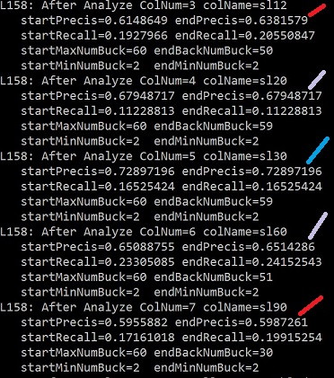

# Analyzing Predictive value of features used predicting future stock prices

In  the article [predict-future-stock-price-using-machine-learning](https://bitbucket.org/joexdobs/ml-classifier-gesture-recognition/wiki/stock-example/predict-future-stock-price-using-machine-learning.md)  I explain how to use Quantized classifier to increase your chance of buying SPY and exiting with a 1% profit before a 1% stop loss is triggered.   Only 32% of bars during the test period meet this goal.    The basic classifier was able to select rows that met the goal 65% of the time while  finding 24% of all bars that met the goal.

The [Quantized Classifier](https://bitbucket.org/joexdobs/ml-classifier-gesture-recognition)  includes a the capability to analyze each feature to identify the the best minimum and maximum number of buckets for that feature.  It can also identify which features provide the greatest predictive value along with those that may actually reduce predictive accuracy. 

Using the feature analyzer we were able to increase this precision for the success class to 71% accuracy with a 19.5% recall.  

| Results From Simple Classify         | Results from Feature Analyze then Classify |
| ------------------------------------ | ---------------------------------------- |
|  |      |

I used the -AnalClassId=1  option to instruct the feature analyzer to maximize accuracy for class 1 the success case.  It did improve the success case but reduced accuracy for the failure class 0.   The default is to improve precision for the entire set rather than a specific class.   When operating on the entire set it tends to favour increasing precision for the class with the greatest population.  

## 

### How to Use 

More details are included below section is just a quick walk through 

>  * Download and install the software through compilation as is described in the main [readme](../../../../readme.md). 
>  * Ensure the stock data you need has been downloaded.  As sample script is [yahoo-stock-download.py](../../../../yahoo-stock-download.py)
>  * Run the [stock-prep-sma.py]([../../../../stock-prep-sma.py]) Python utility to generate the machine learning stock input data from spy.csv.   This utility creates three files [spy.slp30.test.csv](../../../../data/spy.slp30.test.csv),  [spy.slp30.train.csv](../../../../data/spy.slp30.train.csv),  [spy.slp30.class.csv](../../../../data/spy.slp30.class.csv) the class file is the last 5 rows of your input data to use in the prediction stage below.   This utility is only an example feel free to modify it to use different logic to generate the files.  The line that actually generates the data we need for this example is:
>  >
>  >```python
>  > process("data/spy.csv", 0.01, 0.01,30,"close") 
>  >```

>  * Change directory to  demo/stock/spy/1-up-1-dn inside the main repository if you want to use the pre-created scripts.  If you want to directly invoke classify files then CWD should be set to the location where the classifyfiles executable is located.    These commands assume relative placement of the data and tmpout directories. 

>  * Run Classify Test script to ensure it works.  **classifyTest [bat](../classifyTest.bat)   [sh](../classifyTest.sh)**   it will show you the basic results without the feature analyzer.
>
>  >  ```
>  >  classifyFiles -train=data/spy.slp30.train.csv -test=data/spy.slp30.test.csv -maxBuck=140 -testOut=tmpout/spy.slp30.out.csv 
>  >  ```

>  * Run the Pre-Analyze Script  **pre-analyze [bat](../pre-analyze.bat)   [sh](../pre-analyze.sh)** The analyzer will create a file at the same location as the file named in -testout with the ".csv" replaced with ".anal.save.json" and with ".out." removed.  This file is used by a future step that reloads these settings.
>  > ```
>  > classifyFiles -train=data/spy.slp30.train.csv -test=data/spy.slp30.test.csv -maxBuck=60 -testOut=tmpout/spy.slp30.out.csv  -detToStdOut=false -doPreAnalyze=true -AnalSplitType=2 -AnalClassId=1  -AnalTestPort=100
>  > ```
>
>
>  * Run the classify test  script using the saved settings classTestLoadAnal.bat  [.bat](../classify-load-analyze-set.bat)   .sh  This allows the system to run fast while using the settings found by the prior analysis run. 
>  > ```
>  > classifyFiles -train=data/spy.slp30.train.csv -test=data/spy.slp30.test.csv -maxBuck=60 -testOut=tmpout/spy.slp30.out.csv  -detToStdOut=false -LoadSavedAnal=true
>  > ```

> * Generate a smaller input data file to test the classifier.    The utility [stock-prep-sma.py]([../../../../stock-prep-sma.py])  automaically creates this file with the last 5 lines representing the last 5 lines in teh bar file.  You will need code to support it if using a different process to convert your bar data to machine learning friendly data.  For this example it creates [spy.slp30.class.csv](../../../../data/spy.slp30.class.csv)
>
>   >```
>   >class,sl3,sl6,sl12,sl20,sl30,sl60,sl90
>   >0,-0.00014541673556462854,-0.0007097717256464173,0.0035964656846071384,0.004098593390297412,0.0014449206467823936,-0.000533682686715535,0.00027936828419169074
>   >0,0.0015543374430991754,0.0008066452611167948,0.003720309280400876,0.003529907049319071,0.0009085995834736885,-0.0006790433130680721,0.0001769474068949657
>   >0,-0.0029634910175443245,-0.0017691942921778626,0.002991104208557092,0.0034150680493222783,0.0007707995990414436,-0.0007087126578750539,-2.3401882533129365e-05
>   >0,-0.002734872421518112,-0.0014395480342117859,0.003372705521832916,0.001729943972868183,0.0008174775048545974,-0.0005899838559426863,-2.5365801531977463e-05
>   >0,-0.002510435779365966,-0.0004839022646289418,0.001216058671872657,0.0013362951078898788,0.0009281093005361374,-0.0005227917378917389,-0.0002548108597356057
>   >```
>
> * Run the classifier in live mode without the test feature using the saved analyzer.    It will read the data from  [spy.slp30.class.csv](../../../../data/spy.slp30.class.csv)  and save the results in the file named by  -classOut
> > ```sh
> > classifyFiles -train=data/spy.slp30.train.csv -class=data/spy.slp30.class.csv -maxBuck=140 -classOut=tmpout/spy.slp30.pred.class.csv -testOut=tmpout/spy.slp30.out.csv -LoadSavedAnal=true 
> > ```
> > > Contents of   tmpout/spy.slp30.pred.class.csv after successful run
> > >
> > > ```
> > > ndx,bestClass,bestProb
> > > 0,0,0.51387614
> > > 1,0,0.5973338
> > > 2,0,0.6138425
> > > 3,0,0.5334665
> > > 4,0,0.6731199
> > > ```

>#### Using in a Operational Process 
>
> The assumption is that you would generate your data set use the analyzer and save the settings.  Then you would regenerate a new input file every day containing just the new rows of bar data you want the system to predict for.    When you repeat the classify step each day the output would be used to help determine if you want to buy SPY today.     
>
>After each day is completed you would add that days bar data to the input CSV and regenerate the machine learning files to setup for the next day.
>
>You could run this cycle adding new bars many times per day.  If using hourly or minute bars you would simply move data from .class input file into the .train file every few minutes and then populate new data into the .class file representing the newest bars.   

#### Right sizing quant grouping

The Analyzer seeks a optimal number of minimum and maximum  number of quanta buckets for each feature.   This is important because some data naturally works better if we can find the ideal quanta grouping.   An example of this is if modeling human sex there are only 2 options so only 2 quanta buckets are needed.  In other instances like age the system may work great if divided into 10 different groups for some predictions but in others it works better to divide it into only 3 or 4 groups.  

For the feature sl6 which looks back 6 days the analyzer found that it needed 120 quanta bucket.  For the SL12 which looks back 12 days it only need 29 buckets.    The ability to change the quanta bucket sizing by features allows the system to adapt to a wide variety of data. 

The analyzer accomplishes this by taking the portion of the training data it reserved for testing and reduces the number of max buckets until it starts seeing the precision drop.  When optimizing for a single class it will looks for a combination of precision and recall.      Once it finds the smallest maximum number of quant buckets it then increases the minimum number of buckets until it see precision start to drop.  It keeps the buckets inbetween the minimum and maximum for future classification activity. 

### Not all Features have equal value

The indicator used for the tutorial was a very simple slope of price change compared to a bar in the past.   The column named **sl3** is looking 3 bars back while sl6 is looking 6 bars back.   The total set of features used are sl3, sl6, sl12, sl20, sl30, sl60, sl90.     You could approximate these visually by drawing lines from current bar to the price that many bars back.  It is not a great indicator but it does allow the system to see a short term rise in comparison to a mid term drop.

When you think about a 1% rise of SPY unless markets are particularly volatile it will normally take a few days for the price to move upwards by 1%.  

The Analyzer found that for this goal sl6 which looks 6 days back was able to obtain 80% precision with a 32.9% recall.  In contrast   SL60 which looks back 60 days was only able to obtain 54% accuracy but with high recall.     

> > It is fairly likely that SL60 is negatively contributing to the accuracy of the prediction and should be remove.   SL60 may be perfectly good for a different classification but the amount of time you need to look forward or backwards from the current bar is influenced by how long you will hold it.  In most instances the SPY will only take a few days to move up or down so the SL60 is probably looking to far away.  SL60 may be perfectly good input if it was based on the slope compared to the lowest price within the last 60 days instead of a simple sliding window.

Think of this like comparing two gamblers.  You have one gamber who is predicting  winning boxer 3 out of 4 times.   You have another gambler predicting 1/2 the time.    I may be better off  listening  to only the more accurate gambler because if I average the two my next win ratio is likely to drop.     However if I have 3rd gambler who is predicting the winning boxer with 69% accuracy I may gain an advantage by listening to the top two.

There are many ways to combine inputs one would be to sum the confidence from each gambler and average the outputs.    Another would be to only take the bet is 3 of your best experts agree.  You will get more trades with the first approach but you may win more of the time with the second. 

The current Quantized probability classifier uses a weighted average combination mechanism so it is probably better to remove columns the classifier has identified as not contributing favorably to the predictive value.   You should always test the impact of this kind of change and keep backups just in case.     In general the precision for a given feature is below the precision of the set as a whole then I consider removing or deprioritizing it.  

### Multi-feature caveat

While single feature analysis can help identify features that have particularly high value there are times when sets of multiple features when combined will produce higher accuracy than any single feature.    This works when the one feature is able to reduce the probability contributed by another feature for rows that do not match.  There is also a risk that another feature could reduce the impact  for a good match so it is quite tricky to find the set of feature combinations that actually work well together.  The Analyzer includes functionality to do this in a semi-automated fashion which I will cover in a future article. 

### Choosing the portion of the training set to analyze

The analyzer is not allowed to look at your test data during the analyze run so it partitions the training data and uses part of it like it was test data.     This means you need sufficient spare training data so the classifier can use part of it without loosing too much input into the training statistics.  

To choose the amount of training data to use as test data during the analysis phase set -AnalTestPort=0.1  where the number is a value between 0.0 and 1.0.   For larger data sets this provides nice isolation and can allow the analysis system to run faster. 

There is a option to tell the classifier to use all the training data which can improve results when there is limited amount of training data available.    To enable this option set -AnalTestPort=100. 

## Feature Analysis Options Explained

```sh
					
  -LoadSavedAnal       When true will load previously saved
	                  analyzer output and use that to control min
					 max num of buckets and feature weight.  If 
					 analyzer file does not exist then has no effect
					 defaults to false. The analyzer file is automatically
					 created by the -DoPreAnalyze with it's name 
					 and location derived from file named by
					 -testout option.
					
  -DoPreAnalyze      If true will pre-analyze data set attempting
	                 to find number of buckets for each column
				    that maximizes a combination of precision and
					recall.  Defaults to false
					
  -AnalClassId       When specified it will analyze based on finding
	                 best settings for the specified class otherwise
				    will try to find best precision for the entire
				    set of records.  Defaults to not set
	
  -AnalSplitType     if 1 then split by pulling test records from
	                 body of training data.  If 2 then pull test
				    records from end of training data. Defaults
				    to 1.   Ignored when -AnalSplitPort is set to
				    100.
	
  -AnalSplitPort     The portion of training set to use as test data
	                 defaults to 0.15 if not set.  When set to 100
			        it will use entire training set as both test
				    and train during the analysis phase.
```

### Results for running analyze script on data set seeking a 1% gain before the market drops by 1%

```
L50: outBaseName=tmpout/spy.slp30.out.csv
L139: DoPreAnalyze() Use entire training set as test numRow=1399Analyze #TrainRow=1399 #TestRow=1399
Analyze for ClassId=1
L158: After Analyze ColNum=1 colName=sl3
   startPrecis=0.65833336 endPrecis=0.65891474
   startRecall=0.16737288 endRecall=0.18008475
   startMaxNumBuck=60 endBackNumBuck=43
   startMinNumBuck=2  endMinNumBuck=2
L158: After Analyze ColNum=2 colName=sl6
   startPrecis=0.68503934 endPrecis=0.703125
   startRecall=0.18432203 endRecall=0.19067797
   startMaxNumBuck=60 endBackNumBuck=58
   startMinNumBuck=2  endMinNumBuck=2
L158: After Analyze ColNum=3 colName=sl12
   startPrecis=0.6148649 endPrecis=0.6381579
   startRecall=0.1927966 endRecall=0.20550847
   startMaxNumBuck=60 endBackNumBuck=50
   startMinNumBuck=2  endMinNumBuck=2
L158: After Analyze ColNum=4 colName=sl20
   startPrecis=0.67948717 endPrecis=0.67948717
   startRecall=0.11228813 endRecall=0.11228813
   startMaxNumBuck=60 endBackNumBuck=59
   startMinNumBuck=2  endMinNumBuck=2
L158: After Analyze ColNum=5 colName=sl30
   startPrecis=0.72897196 endPrecis=0.72897196
   startRecall=0.16525424 endRecall=0.16525424
   startMaxNumBuck=60 endBackNumBuck=59
   startMinNumBuck=2  endMinNumBuck=2
L158: After Analyze ColNum=6 colName=sl60
   startPrecis=0.65088755 endPrecis=0.6514286
   startRecall=0.23305085 endRecall=0.24152543
   startMaxNumBuck=60 endBackNumBuck=51
   startMinNumBuck=2  endMinNumBuck=2
L158: After Analyze ColNum=7 colName=sl90
   startPrecis=0.5955882 endPrecis=0.5987261
   startRecall=0.17161018 endRecall=0.19915254
   startMaxNumBuck=60 endBackNumBuck=30
   startMinNumBuck=2  endMinNumBuck=2
L274: After analyze setPrec all Feat enabled = 0.7019299
L90: write 3555 bytes to tmpout/spy.slp30.anal.sav.json
write CSV sum rows to tmpout/spy.slp30.out.sum.csv

Summary By Class
Train Probability of being in any class
class=1,  cnt=944  prob=0.33738384
class=0,  cnt=1854  prob=0.66261613
Num Train Row=1399 NumCol=8

RESULTS FOR TEST DATA
  Num Test Rows=350
  Total Set Precis=0.7171429
class=0 ClassCnt=238 classProb=0.68
   Predicted=319 Correct=229
   recall=0.96218485  Prec=0.7178683
   Lift=0.03786832
class=1 ClassCnt=112 classProb=0.32
   Predicted=31 Correct=22
   recall=0.19642857  Prec=0.7096774
   Lift=0.3896774
Finished ClassifyTestFiles()
```

Thanks Joe Ellsworth  2017-02-05

Feel free to [contact me](http://BayesAnalytic.com/contact) with questions or comments 

I sell [consulting services](http://BayesAnalytic.com/contact).  Let me help you build your Machine Learning application using Quantized classifier. 


 